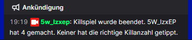

# LoL-Twitch-Killspiel

Automatisierung, um im Twitchchat das *Killspiel* spielen zu können.  
Das *Killspiel* besteht daraus, dass zu Beginn eines League of Legends Spieles der Twitchchat rät, wie viele Kills der Streamer erzielten wird.  
  
Dazu wird zum Beginn eines Spieles (bis zu 2 min später) die Wettphase automatisch gestartet.
  
In der Zeit, die in der [config](#config) geändert werden, können die Chatteilnehmer mit ` !vote [Zahl] `, als z.B. `!vote 5` abstimmen, wenn sie denken, der Streamer erzielt 5 Kills.  
  
Spieler können innerhalb der Zeit beliebig oft anstimmen, nur der letzte Vote zählt. Nach der Zeit wird das Spiel automatisch beendet. Dies wird im Chat bekanntgegeben und die Anzahl an Teilnehmern bekanntgegeben.  
  
Nach dem LoL Spiel wird die Anzahl an erzielten Kills automatisch aus der League-Api besorgt und die Spieler, die richtig getippt haben werden im Chat ausgegeben. Zudem wird eine Json-Datei mit allen Teilnehmern und ihren Tipps in einen *results*-Ordner gespeichert.  
  
<sub>Hier ist keine Auflistung, da nur ein Teilnehmer teilgenommen hat und nicht getroffen hat. Wird in Zukunft vllt noch gefixed.</sub>

## Selber kompilieren

[go(lang)](https://go.dev/dl/) installieren

```bash
go build cmd/main.go
```

## config

```json
{
    "Username": "5w_lzxep", // Nutzername für Twitch, muss Moderator sein, da /announce nutzt 
    "Oath": "oauth:bcgf6ogc6svu319nmeqprjgdtdizgw", // Twitch Auth Token
    "Wettdauer": 120, // Sekunden, die der Chat Zeit hat abzustimmen
    "Twitchchannel": "5w_lzxep", // Twitchchannel, auf dem die Nachrichten kommen und die Votes ausgelesen werden
    "Lolaccountname": "5w_lzxep", 
    "Lolapikey": "9os9f-cm5wf8rs-akq5-xrqh-is5p-4skbgcv1ekjg", // LoL api zugang
    "Joinmessage": true // Ob eine Nachricht geschickt werden soll, wenn der Bot verbunden ist.
}
```

---

### OAuth

Entweder über [Twitch](https://dev.twitch.tv/docs/authentication/getting-tokens-oauth/) selber oder, ich nutze immer [diese Drittseite](https://twitchapps.com/tmi/).

### LoL Apikey

Über [Riot](https://developer.riotgames.com/)
- Developer Key. Dieser ist jedoch nur 24h nutzbar
- Register Product -> *Personal API Key* sollte dauerhaften Key liefern. 